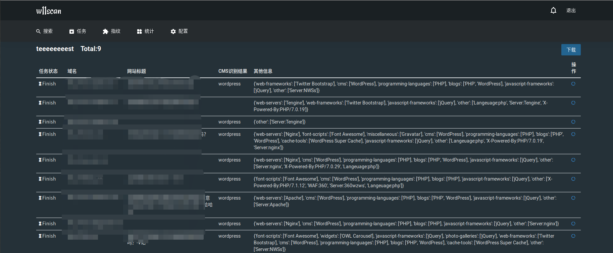

# w11scan
w11scan是一款分布式的WEB指纹识别系统（包括CMS识别、js框架、组件容器、代码语言、WAF等等），管理员可以在WEB端新增/修改指纹，建立批量的扫描任务，并且支持多种搜索语法。  

发现网上没有很多开源的指纹识别源码，于是暑假就自己写了一款分布式的，顺便学习了一下celery和django，顺便想用这款工具参加知道创宇的kcon(关键免门票)。 因为不想太在前端方面花时间就用了`xunfeng`的前端UI（也希望和xunfeng一样优秀）。看着真不错呢！

## 安装
软件本身安装非常简单，比较复杂的是一些框架、数据库的安装。  
- [安装](./docs/install.md)  
- [docker install](./docs/install-docker.md)
## 流程演示视频

## 使用的技术和思路
### 框架
之前编写的扫描器追求的是轻巧方便，安装简单(甚至不需要安装其他库)，但是这一版使用了很多框架，python3为主要编成语言。分布式用的celery,消息队列用redis,后端数据库是mongodb,WEB用的Django。

### 识别技术
指纹识别依靠三点，关键词，正则和特征hash。w11scan内置了1800多条常见的指纹，可以识别多达538种常见CMS，而且WEB端可以添加修改这些CMS指纹。另外也集成了`builtwith`和[Webeye https://github.com/zerokeeper/WebEye/](https://github.com/zerokeeper/WebEye/).在此表示感谢。  

## Featrue
1. 每个指纹都会有一个`命中率`标记，每次识别成功后，相应指纹命中率会增加，使用指纹时优先使用命中率高的指纹。
2. 优先使用命中率最高的指纹，其次，将指纹按照访问路径分类排序，再优先使用访问路径次数最多的指纹。
3. 一个指纹识别成功后，会停止识别该URL的其他指纹，开始下一个任务
4. 搜索功能支持多种语法，全文搜索(mongodb特性)
5. 支持将内容下载为报表

## show 
Preview [https://x.hacking8.com/?tag=w11scan](https://x.hacking8.com/?tag=w11scan)

